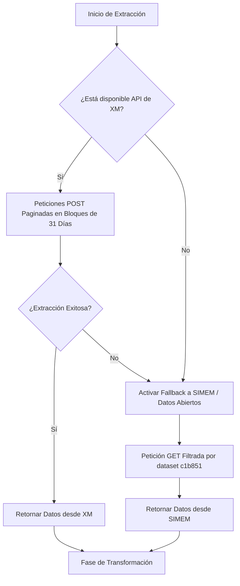

# Documentación de la Tubería ETL Reproducible

Este documento detalla el diseño de ingeniería e implementación técnica de la tubería de Extracción, Transformación y Carga (ETL) desarrollada para predecir la demanda eléctrica del SIN.

---

## 1. Fase de Extracción (Extract)

El proceso de extracción está diseñado para ser altamente tolerante a fallos, utilizando un esquema de contingencia de dos niveles en [extractor.py](file:///c:/Users/santi/OneDrive/Escritorio/Proyecto%20graduacion/src/etl/extractor.py):

### 1.1. Extracción Principal (API de XM)
Se realiza mediante llamadas HTTP POST a la URL de XM utilizando un payload JSON. Debido a la restricción física de la API de XM (máximo 31 días por petición), implementamos la función iterativa `_date_windows` que divide el rango completo de fechas y realiza peticiones consecutivas, concatenando al final los DataFrames resultantes.

### 1.2. Extracción de Contingencia (SIMEM)
Si el servidor de XM está fuera de línea, lanza un error de tiempo de espera (Timeout) o responde en un formato inesperado, la excepción se captura en `extract_historical_demand` y se ejecuta una llamada HTTP GET de contingencia a la API de SIMEM. Esta llamada recupera los registros del dataset de demanda real horaria `c1b851` de manera eficiente.

---

## 2. Fase de Transformación (Transform)

Implementada en [transformer.py](file:///c:/Users/santi/OneDrive/Escritorio/Proyecto%20graduacion/src/etl/transformer.py), esta etapa normaliza y depura los datos crudos antes del modelado estadístico:

### 2.1. Normalización y Limpieza de Datos
*   **Renombrado de Columnas:** Las columnas del dataset de XM o SIMEM se transforman a minúsculas y se eliminan tildes, caracteres especiales y espacios en blanco mediante la función `_normalize_column_name` (ej. `Fecha/Hora` pasa a ser `fecha_hora`).
*   **Imputación y Filtrado:** Se eliminan filas con datos nulos en la columna temporal o en la columna objetivo de demanda real mediante un método de descarte.
*   **Control de Duplicados:** Se eliminan registros duplicados en fecha y hora para evitar sesgos en el entrenamiento de los algoritmos de machine learning.

### 2.2. Ingeniería de Variables Temporales (Feature Engineering)
Se añaden variables para capturar patrones de comportamiento del consumidor eléctrico:
*   `hora`: Hora del día (0 a 23). Captura la curva diaria de carga.
*   `dia`: Día del mes (1 a 31).
*   `mes`: Mes del año (1 a 12). Captura estacionalidades climáticas mensuales.
*   `trimestre`: Trimestre del año (1 a 4).
*   `anio`: Año (ej. 2024).
*   `dia_semana`: Día de la semana (0 para lunes, 6 para domingo).
*   `es_fin_de_semana`: Variable binaria (1 si es sábado o domingo, 0 en otro caso) para capturar la reducción del consumo industrial los fines de semana.
*   `es_festivo`: Variable binaria (1 si la fecha corresponde a un día festivo oficial en Colombia, 0 en otro caso). Se utiliza la librería de Python `holidays` configurando la localización del calendario en `"CO"`. Captura la caída del consumo en días festivos nacionales.

---

## 3. Fase de Carga (Load)

Para garantizar la reproductibilidad y la velocidad de acceso a los datos preprocesados, el transformador exporta el dataset final en dos formatos dentro del directorio `data/processed/`:

1.  **Parquet (`.parquet`):** Formato de almacenamiento columnar optimizado y comprimido mediante PyArrow. Es la fuente recomendada para el entrenamiento de los modelos porque reduce a milisegundos los tiempos de lectura y ahorra espacio de almacenamiento en disco.
2.  **CSV (`.csv`):** Formato tabular en texto plano para compatibilidad externa y revisión visual rápida por parte de analistas o visualizadores externos.
